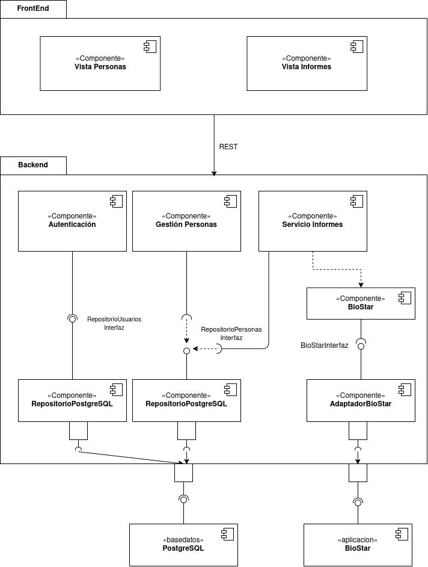
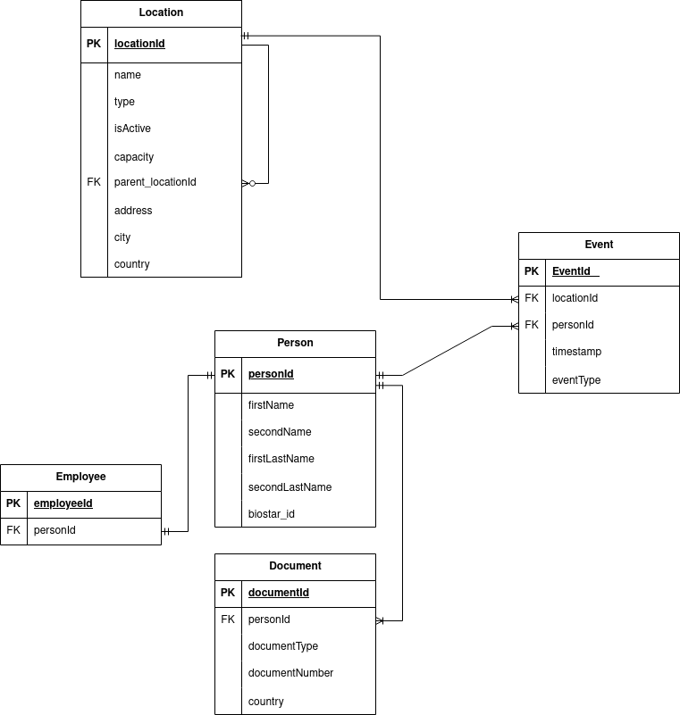

# Arquitectura

Autor: Nicolas Sarmiento  
Fecha: 19 de julio de 2026  
Versión: 1.0  

En el presente documento se detallan las decisiones arquitectónicas aplicadas al desarrollo del Producto Mínimo Viable (MVP) para el sistema de control de accesos del Banco Andino. Además de la de arquitectura seleccionada, se encuentra el diagrama de componentes y el diagrama entidad relación.

## Arquitectura Seleccionada

La arquitectura de sistema seleccionada para el backend del MVP es **monolítica modular**. Esta arquitectura es un monolito construido en módulos. También se seleccionó la **arquitectura de código hexagonal**, de manera simplificada a través del uso de los conceptos de puertos y adaptadores.

La razón para elegir esta arquitectura monolítica es la facilidad para desarrollar dentro de los límites de tiempo establecidos, con ello, se puede entregar valor y se aprovecha que el sistema no tiene grandes cantidades de funcionalidades. Además, al incluir el aspecto de los puertos y adaptadores propios de la arquitectura hexagonal hace que el sistema sea escalable a largo plazo, esto es una característica solicitada por los interesados del proyecto. 

El uso de prácticas de la arquitectura hexagonal permite abstraer el dominio del negocio de las diferentes tecnologías utilizadas. En este caso, las diferentes librerías que se usen se pueden reemplazar cómodamente, siendo este un punto importante, al darle libertad al cliente de cambiar de librerías después. Sin embargo, se aplica de manera simplificada la arquitectura hexagonal solo aplicando conceptos como los puertos y adaptadores, la separación de responsabilidades, pero sin seguir rigurosamente toda el patrón porque puede llegar a tomar más tiempo y más esfuerzo. 

### Arquitecturas Descartadas

A continuación se presenta un resumen de otras arquitecturas de sistema evaluadas para el backend y la justificación del porqué no fueron seleccionadas.

| Arquitectura de Sistema | Justificación |
| --- | --- |
| Arquitectura Orientada a Eventos| Al principio, parecería que las entradas y salidas del sistema se pueden modelar como eventos, permite desacoplar los componentes pero agrega complejidad a la hora de gestionar los eventos y requiere configurar tecnologías para el intercambio de mensajes, lo cual no es viable ya que el sistema solo consumirá una API. |
| Microservicios | Es una arquitectura demasiado compleja, requiere desarrollar cada funcionalidad y desplegarla de forma separada, luego, requiere que cada funcionalidad se integre y para esto es necesario el uso de infraestructura y tecnologías adicionales. Por otro lado, las funcionalidades son pocas y |
| Arquitectura Orientada a Servicios | Es similar a la arquitectura de microservicios, requiere infraestructura para cada funcionalidad, agregando complejidad operativa. | 
| Filtros y tuberías | Esta arquitectura está diseñada para el procesamiento de grandes cantidades de información, lo cual se aleja del objetivo del MVP | 

También se presenta una tabla de las arquitecturas de código que fueron descartadas. Estas opciones son las formas de organizar internamente el código, en este caso del backend.

| Arquitectura de Código | Justificación | 
| --- | --- | 
| Modelo vista controlador | Es simple de implementar, sin embargo tiende a separar poco los componentes, los hace más dificiles de evaluar. Este estilo, acopla mucho los componentes con la lógica de negocio | 
| Arquitectura Clean | Implementarla completamente requiere de tiempo, organización y genera bastante complejidad, sin embargo, algunos de sus principios se pueden aplicar sin tener que utilizarla completamente. | 
| N-capas | Organiza el código por capas que tienen una responsabilidad única, pero no permite el desacoplamiento y la flexibilidad con el uso de tecnologías.| 

## Backend

El lenguaje seleccionado para el backend es TypeScript utilizando Node.js como entorno de ejecución. Esta decisión está basada principalmente en la continuidad tecnológica del cliente. Durante la entrevista se identificó que el equipo interno del frontend cuenta con experiencia en JavaScript, por lo que utilizar TypeScript permite mantener una base tecnológica familiar, reduciendo la curva de aprendizaje y facilitando futuras labores de mantenimiento y evolución del sistema.

Por otro lado, Typescript tiene tipado sobre los datos, lo que mejora la mantenibilidad y contribuye a la reducción los errores. El ambiente de Node provee diferentes librerías y paquetes para la integración con servicios externos y permite desarrollar de forma más eficiente el MVP.

Si bien, existen otros lenguajes utilizados en la industria, como Java, la cual sería perfectamente viable, la decisión se está tomando pensando en la continuidad que el cliente tenga con el sistema.

## Diagrama de Componentes

A continuación se presenta el diagrama de componentes del sistema. En el cual se presenta a un alto nivel la representación de las unidades modulares del sistema. Se puede apreciar el desacomplamiento de las tecnologías externas como la base de datos y la API de BioStar. Adicionalmente, se tienen componentes que proveen esas interfaces y que se pueden reemplazar, por otro componente que provean la misma interfaz.

Existen los componentes de servicio personas, el cual está encargado de ocupar las reglas del negocio y de contener la lógica del negocio en lo que refiere a las funcionalidades para la gestión de los usuarios.

El componente de servicio de informes está encargado de las funcionalidades de los servicios, tiene una dependencia hacia los componentes que consumen BioStar porque son los que proveen la información de los sistemas físicos de acceso.

El componente de autenticación es el encargado de manejar la autenticación de los usuarios del sistema, requiere de una interfaz para realizar las consultas de los datos de usuarios y generar los tokens de autenticación.

En el frontend hay dos componentes principales, la vista de las personas donde se realizan los procesos relacionados a la carga de personas. También está la vista de los informes donde se presenta al usuario la información de los informes y los controles para generarlos.

## Diagrama Entidad-Relación

El diagrama de Entidad-Relación se puede apreciar a continuación. Se realizó en base a los campos presentes en el archivo Excel compartido por el área de Talento Humano del banco.

Para las sedes, se decidió modelar ubicaciones, ya que de esta forma en el futuro se puede agregar los pisos, oficinas, salas de servidores, etc. Se incluye los datos de la dirección y un campo extra que permitirá construir la jerarquía de zonas, ya que una sede puede tener varios pisos, oficinas, entre otras, esto es representado por la relación autorreferencial.

Por otra parte, se decide modelar personas y no empleados directamente porque esto permite que el sistema escale a los diferentes tipos de personas que puedan ingresar, aunque para el MVP solo se trabajará con empleados. Las personas solamente registrarán en el sistema sus nombres y los documentos de identificación que tengan, es posible que se relacione con más de uno.

En la tabla de empleados solamente se guarda el id presente en el Excel, asumiendo que representa una identificación en un sistema interno del banco. El sistema como solamente requiere mostrar la información de qué personas entraron y cuántas hay en el sistema, solamente se almacena dicha información. En caso que por empleado se requiera almacenar más información, entonces se agrega a la tabla de empleado.

Finalmente, la tabla que guarda los eventos, es decir, las entradas y salidas, almacena la ubicación donde ocurre y la persona, así mismo, la hora y fecha y el tipo de evento, si es salida o entrada.

